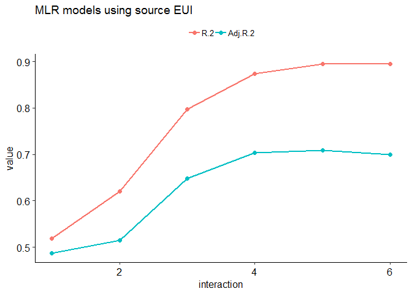
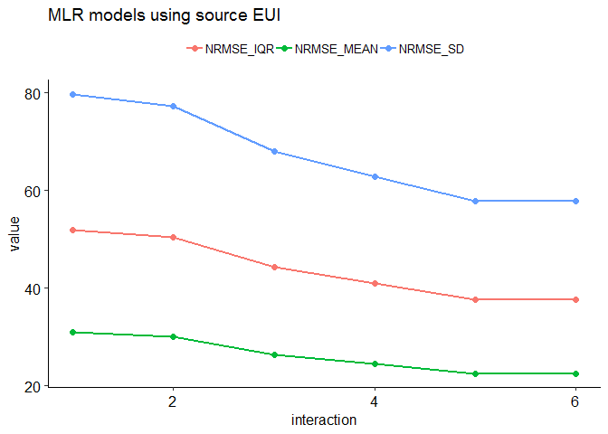
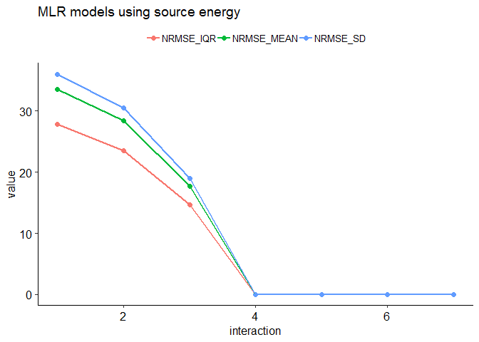

Benchmarking Hotels
================
Pandarasamy Arjunan
3 June 2019

-   [Load dataset](#load-dataset)
-   [Apply filters](#apply-filters)
-   [Prepare features](#prepare-features)
-   [Descriptive statistics](#descriptive-statistics)
    -   [Data Frame Summary](#data-frame-summary)
-   [Build predictive models](#build-predictive-models)
    -   [Multiple Linear Regression (MLR)](#multiple-linear-regression-mlr)
    -   [Multiple Linear Regression (MLR) with Interaction terms](#multiple-linear-regression-mlr-with-interaction-terms)
    -   [Comparision of MLR models](#comparision-of-mlr-models)

Load dataset
------------

``` r
building_type = "hotel"

filtered_dir = './data/cbecs/filtered/'
dir.create(filtered_dir, recursive = T, showWarnings = F)

features_dir = './data/cbecs/features/'
dir.create(features_dir, recursive = T, showWarnings = F)

results_dir = './results/cbecs/'
dir.create(results_dir, recursive = T, showWarnings = F)
```

``` r
cbecs = read.csv("data/cbecs/2012_public_use_data_aug2016.csv")

var1 = c( 'SQFT', 'NFLOOR', 'NELVTR', 'NESLTR', 'COURT', 
          'MONUSE', 'OPNWE',  'WKHRS', 'NWKER', 'COOK', 
          'MANU', 'HEATP',  'COOLP',  'SNACK', 'FASTFD', 'CAF',
          'FDPREP', 'KITCHN', 'BREAKRM', 'OTFDRM', 'LABEQP', 'MCHEQP',
          'POOL', 'HTPOOL', 'RFGWIN', 'RFGOPN', 'RFGCLN', 'RFGVNN',
          'RFGICN', 'PCTERMN', 'LAPTPN', 'PRNTRN', 'SERVERN', 'TVVIDEON',
          'RGSTRN', 'COPIERN', 'HDD65','CDD65')

var2 = c( "PBAPLUS", "PBA", "FINALWT",
          "MFBTU", 
          "ELBTU", "NGBTU", "FKBTU", "DHBTU",
          "ONEACT", "ACT1", "ACT2", "ACT3", "ACT1PCT", "ACT2PCT", "ACT3PCT",
          "PRAMTC", "PRUNIT",
          "CWUSED", "WOUSED", "COUSED", "SOUSED",  "PRUSED",
          "RFGSTP")

var3 = c( "RFGRSN", "RFGCOMPN", "RFGWIN", "RFGOPN", "RFGCLN", "RFGVNN")
var4 = c("LODGRM", "OCCUPYP", "LODOCCP")

hotels = cbecs[, c(var1, var2, var3, var4)]
```

Apply filters
-------------

As per Energy Star's technical document [ENERGY STAR Score for Hotels](https://www.energystar.gov/buildings/tools-and-resources/energy-star-score-hotels), following filters are applied to define the peer group and to remove any outliers.

After applying each filter, the number of remaining buildings in the dataset (*Number Remaining: X*) and any difference (*Difference: X*) in count from the original Energy Star's technical documentation is also given.

1.  **Calculate source energy and source EUI**

    ``` r
    ## convert electricity, natural gas, fuel oil, and district heat to source energy
    h0 = hotels %>% 
      mutate(ELBTU0 = ELBTU*2.80) %>%
      mutate(NGBTU0 = NGBTU*1.05) %>%
      mutate(FKBTU0 = FKBTU*1.01) %>%
      mutate(DHBTU0 = DHBTU*1.20) %>%
      mutate(SOURCE_ENERGY = rowSums(dplyr::select(., c(ELBTU0,NGBTU0,FKBTU0,DHBTU0)), na.rm = T)) %>% 
      mutate(SOURCE_EUI = round(SOURCE_ENERGY/SQFT, 2)) %>%
      mutate(SITE_EUI = round(MFBTU/SQFT, 2)) %>%
      mutate(NGBTU_PERCENT = round(NGBTU / SOURCE_ENERGY * 100, 2)) %>% 
      mutate(SUMBTU = rowSums(dplyr::select(., c(ELBTU,NGBTU,FKBTU,DHBTU)), na.rm = T))

    #Is MFBTU the sum of ELBTU,NGBTU,FKBTU,DHBTU? YES.
    #summary(o14$MFBTU - o14$SUMBTU)
    ```

2.  **PBAPLUS = 38 or 39** <br/>Building Filter – CBECS defines building types according to the variable “PBAPLUS.” Hotels are coded as PBAPLUS = 38 and Motels/Inns are coded as PBAPLUS = 39. <br/>Number Remaining: 220. <br/>Difference: 0.

    ``` r
    h1 = h0 %>% filter(PBAPLUS %in% c(38, 39))
    ```

3.  **Must have at least 1 room** <br/>EPA Program Filter – Baseline condition for being a full time hotel. <br/>Number Remaining: 220. <br/>Difference: 0.

    ``` r
    h2 = h1 %>% filter( LODGRM >= 1)
    ```

4.  **Must operate for 168 hours per week** <br/>EPA Program Filter – Baseline condition for being a full time hotel. <br/>Number Remaining: 218. <br/>Difference: 0.

    ``` r
    h3 = h2 %>% filter(WKHRS == 168)
    ```

5.  **Must have at least 1 worker** <br/>EPA Program Filter – Baseline condition for being a full time hotel. <br/>Number Remaining: 215. <br/>Difference: 0.

    ``` r
    h4 = h3 %>% filter(NWKER >= 1)
    ```

6.  **Must operate for at least 10 months per year** <br/>EPA Program Filter – Baseline condition for being a functioning office building. <br/>Number Remaining: 209. <br/>Difference: 0.

    ``` r
    h5 = h4 %>% filter(MONUSE >= 10)
    ```

7.  **A single activity must characterize greater than 50% of the floor space** <br/>EPA Program Filter – In order to be considered part of the hotel peer group, more than 50% of the building must be defined as a hotel. <br/>This filter is applied by a set of screens. If the variable ONEACT=1, then one activity occupies 75% or more of the building. If the variable ONEACT=2, then the activities in the building are defined by ACT1, ACT2, and ACT3. One of these activities must be coded as lodging (PBAX=22), with a corresponding percent (ACT1PCT, ACT2PCT, ACT3PCT) that is greater than 50. <br/>Number Remaining: 205. <br/>Difference: +1.

    ``` r
    h6 = h5 %>% 
      filter( (ONEACT == 1) |
            (ONEACT == 2 & 
               ((ACT1 %in% c(22) & ACT1PCT > 50) | 
                  (ACT2 %in% c(22) & ACT2PCT > 50) | 
                  (ACT3 %in% c(22) & ACT3PCT > 50) )))
    ```

8.  **Must report energy usage** <br/>EPA Program Filter – Baseline condition for being a functioning office building. <br/>Number Remaining: 205. <br/>Difference: +1.

    ``` r
    h7 = h6 %>% filter(!is.na(MFBTU))
    ```

9.  **Must be less than or equal to 1,000,000 square feet** <br/>Data Limitation Filter – CBECS masks surveyed properties above 1,000,000 square feet by applying regional averages. <br/>Number Remaining: 197. <br/>Difference: +1.

    ``` r
    h8 = h7 %>% filter(SQFT <= 1000000)
    ```

10. **If propane is used, the amount category (PRAMTC) must equal 1, 2, or 3** <br/>Data Limitation Filter – Cannot estimate propane use if the quantity is “greater than 1000” or unknown. <br/>Number Remaining: 186. <br/>Difference: +1.

    ``` r
    h9 = h8 %>% filter(is.na(PRAMTC) | PRAMTC %in% c(1,2,3))
    ```

11. **If propane is used, the unit (PRUNIT) must be known** <br/>Data Limitation Filter – Cannot estimate propane use if the unit is unknown. <br/>Number Remaining: 184. <br/>Difference: +1.

    ``` r
    h10 = h9 %>% filter(is.na(PRUNIT) | PRUNIT %in% c(1,2))
    ```

12. **If propane is used, the maximum estimated propane amount must be 10% or less of the total source energy** <br/>Data Limitation Filter – Because propane values are estimated from a range, propane is restricted to 10% of the total source energy. <br/>Number Remaining: 176. <br/>Difference: -7.

    ``` r
    h11 = h10 %>% 
      filter( PRUSED == 2 | is.na(NGBTU_PERCENT) == T | 
            ( PRUSED == 1 & NGBTU_PERCENT <= 10))
    ```

13. **must not use chilled water, wood, coal, or solar** <br/>Data Limitation Filter – Because propane values are estimated from a range, propane is restricted to 10% of the total source energy. <br/>Number Remaining: 171. <br/>Difference: -6.

    ``` r
    h12 = h11 %>% 
      filter(CWUSED == 2 & WOUSED == 2 & COUSED == 2 & SOUSED == 2)
    ```

14. **Must be at least 5,000 square feet** <br/>Data Limitation Filter – Because propane values are estimated from a range, propane is restricted to 10% of the total source energy. <br/>Number Remaining: 162. <br/>Difference: -7.

    ``` r
    h13 = h12 %>% filter(SQFT >= 5000)
    ```

15. **Must have Source EUI less than or equal to 400 kBtu/ft2** <br/>Data Limitation Filter – Because propane values are estimated from a range, propane is restricted to 10% of the total source energy. <br/>Number Remaining: 156. <br/>Difference: -7.

    ``` r
    h14 = h13 %>% filter(SOURCE_EUI <= 400)
    ```

16. **Must have no more than 4 rooms per 1,000 square feet** <br/>Data Limitation Filter – Because propane values are estimated from a range, propane is restricted to 10% of the total source energy. <br/>Number Remaining: 146. <br/>Difference: -6.

    ``` r
    h15 = h14 %>% filter(LODGRM/SQFT *1000 <= 4)
    ```

17. **Must have average occupancy greater than 40%** <br/>Data Limitation Filter – Because propane values are estimated from a range, propane is restricted to 10% of the total source energy. <br/>Number Remaining: 133. <br/>Difference: -6.

    ``` r
    h16 = h15 %>% filter(LODOCCP > 40)
    ```

**Save the filtered dataset**

``` r
write.csv(h16, paste0(filtered_dir, building_type, ".csv"), row.names = F)
```

Prepare features
----------------

The final regression equation includes the following variables:

-   Number of Guest Rooms per 1,000 Square Feet
-   Number of Workers per 1,000 Square Feet
-   Number of Commercial Refrigeration/Freezer Units (walk-in, open, and closed) per 1,000 Square Feet
-   Heating Degree Days times Percent of the Building that is Heated
-   Cooling Degree Days times Percent of the Building that is Cooled
-   Presence of a Commercial/Large Kitchen (1 = yes, 0 = no)

``` r
hotel = read.csv(paste0(filtered_dir, building_type, ".csv"))

data = hotel %>%
  dplyr::mutate(LODGRM_SQFT = LODGRM/SQFT * 1000) %>%
  dplyr::mutate(NWKER_SQFT = NWKER/SQFT * 1000) %>%
  dplyr::mutate(RFG_TOT = rowSums(dplyr::select(., c(RFGRSN,RFGCOMPN,RFGWIN,RFGOPN,RFGCLN,RFGVNN)), na.rm = T)) %>% 
  dplyr::mutate(RFG_SQFT = RFG_TOT/SQFT * 1000) %>%
  dplyr::mutate(HDD65_HEATP = HDD65 * HEATP / 100) %>%
  dplyr::mutate(CDD65_COOLP = CDD65 * COOLP / 100) %>%
  dplyr::mutate(Kitchen = ifelse(FDPREP == 1, "Yes", "No")) %>%
  dplyr::mutate_if(is.numeric, round, 3)

ivars = c( "SQFT",
           "LODGRM_SQFT", "NWKER_SQFT", "RFG_SQFT",
          "HDD65_HEATP", "CDD65_COOLP", "Kitchen")

dvars  = c("SOURCE_EUI", "SOURCE_ENERGY", "FINALWT")

features = data[, c(ivars, dvars)]
#summary(features)

features = features %>% na.omit()

write.csv(features, 
          paste0(features_dir, building_type, ".csv"), 
          row.names = F)
```

Descriptive statistics
----------------------

``` r
features1 = features

features1 = features1 %>% dplyr::select(-one_of('SOURCE_ENERGY', 'FINALWT'))

summarytools::descr(features1, stats = "common", 
                    transpose = TRUE, 
                    headings = FALSE)
```

    Non-numerical variable(s) ignored: Kitchen

|                  |       Mean|    Std.Dev|      Min|     Median|        Max|  N.Valid|  Pct.Valid|
|-----------------:|----------:|----------:|--------:|----------:|----------:|--------:|----------:|
|  **CDD65\_COOLP**|    1731.33|     983.44|    77.00|    1508.00|    4608.00|    98.00|     100.00|
|  **HDD65\_HEATP**|    3397.90|    2049.32|    76.00|    3267.00|    8180.00|    98.00|     100.00|
|  **LODGRM\_SQFT**|       1.38|       0.51|     0.44|       1.33|       2.96|    98.00|     100.00|
|   **NWKER\_SQFT**|       0.38|       0.33|     0.07|       0.28|       2.00|    98.00|     100.00|
|     **RFG\_SQFT**|       0.76|       0.75|     0.01|       0.46|       3.33|    98.00|     100.00|
|   **SOURCE\_EUI**|     183.25|      71.24|    60.80|     172.32|     381.12|    98.00|     100.00|
|          **SQFT**|  217646.99|  200186.47|  7900.00|  132000.00|  900000.00|    98.00|     100.00|

``` r
dfSummary(features1, plain.ascii = FALSE, style = "grid", 
          graph.magnif = 0.75, valid.col = FALSE)
```

    text graphs are displayed; set 'tmp.img.dir' parameter to activate png graphs

### Data Frame Summary

**features1**
**Dimensions:** 98 x 8
**Duplicates:** 0

<table>
<colgroup>
<col width="4%" />
<col width="13%" />
<col width="30%" />
<col width="19%" />
<col width="22%" />
<col width="9%" />
</colgroup>
<thead>
<tr class="header">
<th>No</th>
<th>Variable</th>
<th>Stats / Values</th>
<th>Freqs (% of Valid)</th>
<th>Graph</th>
<th>Missing</th>
</tr>
</thead>
<tbody>
<tr class="odd">
<td><p>1</p></td>
<td><p>SQFT<br />
[numeric]</p></td>
<td><p>Mean (sd) : 217647 (200186.5)<br />
min &lt; med &lt; max:<br />
7900 &lt; 132000 &lt; 9e+05<br />
IQR (CV) : 222250 (0.9)</p></td>
<td><p>65 distinct values</p></td>
<td><dl>
<dt></dt>
<dd>.<br />

</dd>
<dd>:<br />

</dd>
<dd>:<br />

</dd>
<dd>: :<br />

</dd>
<dd>: : : : : .
</dd>
</dl></td>
<td><p>0<br />
(0%)</p></td>
</tr>
<tr class="even">
<td><p>2</p></td>
<td><p>LODGRM_SQFT<br />
[numeric]</p></td>
<td><p>Mean (sd) : 1.4 (0.5)<br />
min &lt; med &lt; max:<br />
0.4 &lt; 1.3 &lt; 3<br />
IQR (CV) : 0.7 (0.4)</p></td>
<td><p>81 distinct values</p></td>
<td><p><br />
    :<br />
    : .<br />
  : : :<br />
  : : :<br />
. : : : : .</p></td>
<td><p>0<br />
(0%)</p></td>
</tr>
<tr class="odd">
<td><p>3</p></td>
<td><p>NWKER_SQFT<br />
[numeric]</p></td>
<td><p>Mean (sd) : 0.4 (0.3)<br />
min &lt; med &lt; max:<br />
0.1 &lt; 0.3 &lt; 2<br />
IQR (CV) : 0.3 (0.9)</p></td>
<td><p>85 distinct values</p></td>
<td><p><br />
:<br />
:<br />
: :<br />
: : .<br />
: : : .</p></td>
<td><p>0<br />
(0%)</p></td>
</tr>
<tr class="even">
<td><p>4</p></td>
<td><p>RFG_SQFT<br />
[numeric]</p></td>
<td><p>Mean (sd) : 0.8 (0.8)<br />
min &lt; med &lt; max:<br />
0 &lt; 0.5 &lt; 3.3<br />
IQR (CV) : 1.2 (1)</p></td>
<td><p>92 distinct values</p></td>
<td><p><br />
:<br />
:<br />
:<br />
:   . .<br />
: : : : .</p></td>
<td><p>0<br />
(0%)</p></td>
</tr>
<tr class="odd">
<td><p>5</p></td>
<td><p>HDD65_HEATP<br />
[numeric]</p></td>
<td><p>Mean (sd) : 3397.9 (2049.3)<br />
min &lt; med &lt; max:<br />
76 &lt; 3267 &lt; 8180<br />
IQR (CV) : 2935.8 (0.6)</p></td>
<td><p>97 distinct values</p></td>
<td><p><br />
    :<br />
  . : : :<br />
: : : : : :<br />
: : : : : :<br />
: : : : : : : :</p></td>
<td><p>0<br />
(0%)</p></td>
</tr>
<tr class="even">
<td><p>6</p></td>
<td><p>CDD65_COOLP<br />
[numeric]</p></td>
<td><p>Mean (sd) : 1731.3 (983.4)<br />
min &lt; med &lt; max:<br />
77 &lt; 1508 &lt; 4608<br />
IQR (CV) : 1125.4 (0.6)</p></td>
<td><p>98 distinct values</p></td>
<td><p><br />
    . :<br />
  : : :<br />
  : : :<br />
  : : : .     .<br />
: : : : : : : : . .</p></td>
<td><p>0<br />
(0%)</p></td>
</tr>
<tr class="odd">
<td><p>7</p></td>
<td><p>Kitchen<br />
[character]</p></td>
<td><p>1. No<br />
2. Yes</p></td>
<td><p>42 (42.9%)<br />
56 (57.1%)</p></td>
<td><p>IIIIIIII<br />
IIIIIIIIIII</p></td>
<td><p>0<br />
(0%)</p></td>
</tr>
<tr class="even">
<td><p>8</p></td>
<td><p>SOURCE_EUI<br />
[numeric]</p></td>
<td><p>Mean (sd) : 183.3 (71.2)<br />
min &lt; med &lt; max:<br />
60.8 &lt; 172.3 &lt; 381.1<br />
IQR (CV) : 109.4 (0.4)</p></td>
<td><p>98 distinct values</p></td>
<td><p><br />
  : :<br />
  : :<br />
  : : : :<br />
: : : : :<br />
: : : : : . .</p></td>
<td><p>0<br />
(0%)</p></td>
</tr>
</tbody>
</table>

**Extract R code from Rmd document**

``` r
#knitr::purl("office.Rmd", output = "office.R", documentation = 2)
```

Build predictive models
-----------------------

``` r
source("models.R")
source("metrics.R")

data = read.csv(paste0(features_dir, building_type, ".csv"))

cat(colnames(data))
```

SQFT LODGRM\_SQFT NWKER\_SQFT RFG\_SQFT HDD65\_HEATP CDD65\_COOLP Kitchen SOURCE\_EUI SOURCE\_ENERGY FINALWT

``` r
allMetrics = NULL
```

### Multiple Linear Regression (MLR)

#### Using SOURCE\_EUI as dependent variable

``` r
y = "SOURCE_EUI"
w = "FINALWT"
o = c("SOURCE_ENERGY", "SQFT")
x = setdiff(colnames(data), c(y, w, o))
wt = data[, w]
intr = 1

mlrFit = MLR(data, x, y, w, interaction = intr)

obs  = data[, y]
pred = as.numeric(predict(mlrFit))

mlrMetrics1 = getMLRmetrics(mlrFit, obs, pred, wt)
mlrMetrics1 = data.frame(
  "model" = "MLR",
  "dependent" = y,
  "interaction" = intr,
  "transform" = "meanCent",
  mlrMetrics1)

allMetrics = rbind(allMetrics, mlrMetrics1)

knitr::kable(mlrMetrics1, row.names = F)
```

| model | dependent   |  interaction| transform |  obs|  rank|  coef|    R.2|  Adj.R.2|       mse|    rmse|     mae|   mape|  nrmse\_iqr|  nrmse\_range|  nrmse\_mean|  nrmse\_sd|
|:------|:------------|------------:|:----------|----:|-----:|-----:|------:|--------:|---------:|-------:|-------:|------:|-----------:|-------------:|------------:|----------:|
| MLR   | SOURCE\_EUI |            1| meanCent  |   98|     7|     7|  0.519|    0.487|  3225.436|  56.793|  43.441|  0.242|       51.91|         17.73|       30.992|     79.723|

#### Using SOURCE\_ENERGY as dependent variable\*\*

``` r
y = "SOURCE_ENERGY"
w = "FINALWT"
o = c("SOURCE_EUI")
x = setdiff(colnames(data), c(y, w, o))
wt = data[, w]
intr = 1

mlrFit = MLR(data, x, y, w, interaction = intr)

obs  = data[, y]
pred = as.numeric(predict(mlrFit))

mlrMetrics2 = getMLRmetrics(mlrFit, obs, pred, wt)
mlrMetrics2 = data.frame(
  "model" = "MLR",
  "dependent" = y,
  "interaction" = intr,
  "transform" = "meanCent",
  mlrMetrics2)
allMetrics = rbind(allMetrics, mlrMetrics2)
knitr::kable(allMetrics, row.names = F)
```

| model | dependent      |  interaction| transform |  obs|  rank|  coef|    R.2|  Adj.R.2|           mse|          rmse|          mae|   mape|  nrmse\_iqr|  nrmse\_range|  nrmse\_mean|  nrmse\_sd|
|:------|:---------------|------------:|:----------|----:|-----:|-----:|------:|--------:|-------------:|-------------:|------------:|------:|-----------:|-------------:|------------:|----------:|
| MLR   | SOURCE\_EUI    |            1| meanCent  |   98|     7|     7|  0.519|    0.487|  3.225436e+03|        56.793|       43.441|  0.242|      51.910|        17.730|       30.992|     79.723|
| MLR   | SOURCE\_ENERGY |            1| meanCent  |   98|     8|     8|  0.895|    0.887|  1.803708e+14|  13430219.878|  9080424.454|  0.383|      27.788|         9.234|       33.515|     35.980|

### Multiple Linear Regression (MLR) with Interaction terms

#### Using SOURCE\_EUI as dependent variable

``` r
y = "SOURCE_EUI"
w = "FINALWT"
o = c("SOURCE_ENERGY", "SQFT")
x = setdiff(colnames(data), c(y, w, o))
wt = data[, w]

intr_depth = length(x)

for (intr in 2:intr_depth) {
  
  mlrFit = MLR(data, x, y, w, interaction = intr)
  obs  = data[, y]
  pred = as.numeric(predict(mlrFit))
  
  mlrMetrics = getMLRmetrics(mlrFit, obs, pred, wt)
  mlrMetrics = data.frame(
    "model" = paste0("MLRi", intr),
    "dependent" = y,
    "interaction" = intr,
    "transform" = "meanCent",
    mlrMetrics)
  
  allMetrics = rbind(allMetrics, mlrMetrics)
}

allMetrics0 = allMetrics %>% filter(dependent == y)
knitr::kable(allMetrics0, row.names = F)
```

| model | dependent   |  interaction| transform |  obs|  rank|  coef|    R.2|  Adj.R.2|       mse|    rmse|     mae|   mape|  nrmse\_iqr|  nrmse\_range|  nrmse\_mean|  nrmse\_sd|
|:------|:------------|------------:|:----------|----:|-----:|-----:|------:|--------:|---------:|-------:|-------:|------:|-----------:|-------------:|------------:|----------:|
| MLR   | SOURCE\_EUI |            1| meanCent  |   98|     7|     7|  0.519|    0.487|  3225.436|  56.793|  43.441|  0.242|      51.910|        17.730|       30.992|     79.723|
| MLRi2 | SOURCE\_EUI |            2| meanCent  |   98|    22|    22|  0.620|    0.515|  3037.103|  55.110|  40.682|  0.229|      50.371|        17.205|       30.073|     77.360|
| MLRi3 | SOURCE\_EUI |            3| meanCent  |   98|    42|    42|  0.797|    0.648|  2346.616|  48.442|  34.816|  0.200|      44.277|        15.123|       26.435|     68.000|
| MLRi4 | SOURCE\_EUI |            4| meanCent  |   98|    57|    57|  0.874|    0.703|  2006.153|  44.790|  30.259|  0.177|      40.939|        13.983|       24.442|     62.873|
| MLRi5 | SOURCE\_EUI |            5| meanCent  |   98|    63|    63|  0.895|    0.708|  1702.391|  41.260|  28.187|  0.165|      37.712|        12.881|       22.515|     57.918|
| MLRi6 | SOURCE\_EUI |            6| meanCent  |   98|    64|    64|  0.895|    0.699|  1698.416|  41.212|  28.204|  0.165|      37.668|        12.866|       22.489|     57.851|

#### Using SOURCE\_ENERGY as dependent variable\*\*

``` r
y = "SOURCE_ENERGY"
w = "FINALWT"
o = c("SOURCE_EUI")
x = setdiff(colnames(data), c(y, w, o))
wt = data[, w]
intr_depth = length(x)

for (intr in 2:intr_depth) {
  
  mlrFit = MLR(data, x, y, w, interaction = intr)
  obs  = data[, y]
  pred = as.numeric(predict(mlrFit))
  
  mlrMetrics = getMLRmetrics(mlrFit, obs, pred, wt)
  mlrMetrics = data.frame(
    "model" = paste0("MLRi", intr),
    "dependent" = y,
    "interaction" = intr,
    "transform" = "meanCent",
    mlrMetrics)
  
  allMetrics = rbind(allMetrics, mlrMetrics)
}

write.csv(allMetrics, 
          paste0(results_dir, building_type, ".csv"), 
          row.names = F)

allMetrics0 = allMetrics %>% filter(dependent == y)
knitr::kable(allMetrics0, row.names = F)
```

| model | dependent      |  interaction| transform |  obs|  rank|  coef|    R.2|  Adj.R.2|           mse|      rmse|      mae|   mape|  nrmse\_iqr|  nrmse\_range|  nrmse\_mean|  nrmse\_sd|
|:------|:---------------|------------:|:----------|----:|-----:|-----:|------:|--------:|-------------:|---------:|--------:|------:|-----------:|-------------:|------------:|----------:|
| MLR   | SOURCE\_ENERGY |            1| meanCent  |   98|     8|     8|  0.895|    0.887|  1.803708e+14|  13430220|  9080424|  0.383|      27.788|         9.234|       33.515|     35.980|
| MLRi2 | SOURCE\_ENERGY |            2| meanCent  |   98|    29|    29|  0.953|    0.934|  1.293115e+14|  11371523|  7485864|  0.237|      23.528|         7.819|       28.378|     30.465|
| MLRi3 | SOURCE\_ENERGY |            3| meanCent  |   98|    64|    64|  0.977|    0.934|  5.039182e+13|   7098720|  4217495|  0.149|      14.688|         4.881|       17.715|     19.018|
| MLRi4 | SOURCE\_ENERGY |            4| meanCent  |   98|    98|    99|  1.000|      NaN|  0.000000e+00|         0|        0|  0.000|       0.000|         0.000|        0.000|      0.000|
| MLRi5 | SOURCE\_ENERGY |            5| meanCent  |   98|    98|   120|  1.000|      NaN|  0.000000e+00|         0|        0|  0.000|       0.000|         0.000|        0.000|      0.000|
| MLRi6 | SOURCE\_ENERGY |            6| meanCent  |   98|    98|   127|  1.000|      NaN|  0.000000e+00|         0|        0|  0.000|       0.000|         0.000|        0.000|      0.000|
| MLRi7 | SOURCE\_ENERGY |            7| meanCent  |   98|    98|   128|  1.000|      NaN|  0.000000e+00|         0|        0|  0.000|       0.000|         0.000|        0.000|      0.000|

### Comparision of MLR models

#### MLR plots using Source EUI

``` r
library(ggplot2)
library(reshape2)
library(ggpubr)

mytheme = theme(legend.title = element_blank(),
           legend.text=element_text(size=12),
           axis.text=element_text(size=12),
           text=element_text(size=12))

plotR2 <- function(df, titl) {
  
  df1 = melt(df, measure.vars = c("R.2", "Adj.R.2"))
  
  plot <- ggplot(df1, aes(x = interaction, y=value, 
                          group=variable, col=variable)) + 
  geom_point(size=2) + geom_line(size=1) +
    ggtitle(titl) + 
    theme_pubr(base_size=12) +
    theme(legend.position="top", legend.title = element_blank())
  
  return(plot)
}

plotNRMSE <- function(df, titl) {
  
  df1 = melt(df, measure.vars = c("nrmse_iqr", "nrmse_mean", 
                                        "nrmse_sd"))
  df1$variable = toupper(df1$variable)
  
  plot <- ggplot(df1, aes(x = interaction, y=value, 
                          group=variable, col=variable)) + 
  geom_point(size=2) + geom_line(size=1) +
    ggtitle(titl) + 
    theme_pubr(base_size=12) +
    theme(legend.position="top", legend.title = element_blank())
    
  
  return(plot)
}  
```

``` r
allMetrics0 = allMetrics %>%
  filter(stringr::str_detect(model, "MLR")) %>%
  filter(dependent == "SOURCE_EUI")

plot1 = plotR2(allMetrics0, "MLR models using source EUI")
plot2 = plotNRMSE(allMetrics0, "MLR models using source EUI")

print(plot1)
```



``` r
print(plot2)
```



#### MLR plots using Source Energy

``` r
allMetrics0 = allMetrics %>%
  filter(stringr::str_detect(model, "MLR")) %>%
  filter(dependent == "SOURCE_ENERGY")

plot1 = plotR2(allMetrics0, "MLR models using source energy")
plot2 = plotNRMSE(allMetrics0, "MLR models using source energy")

print(plot1)
```

    Warning: Removed 4 rows containing missing values (geom_point).

    Warning: Removed 4 rows containing missing values (geom_path).


``` r
print(plot2)
```


